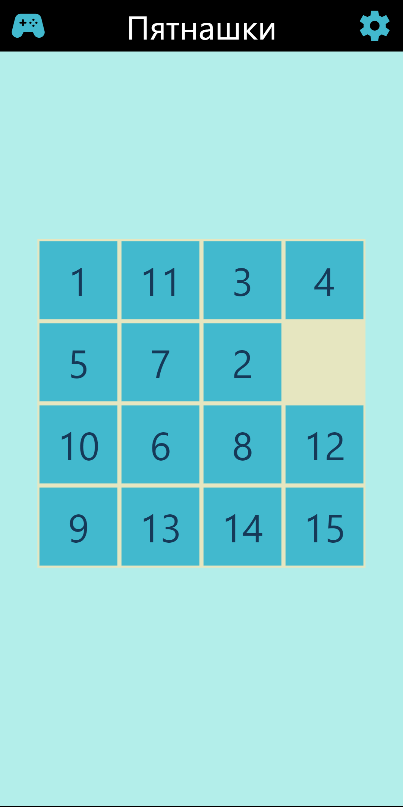

# Пятнашки

 Пятнашки — это головоломка, где нужно перемещать плитки по полю 4x4, чтобы упорядочить числа от 1 до 15, оставив одну ячейку пустой для перемещения.

    

 ## Попробовать
[WEB](https://wracce.github.io/vanilla-pytnawko/)

## Стек технологий
 * JS / HTML / CSS

## Лицензия
MIT license
